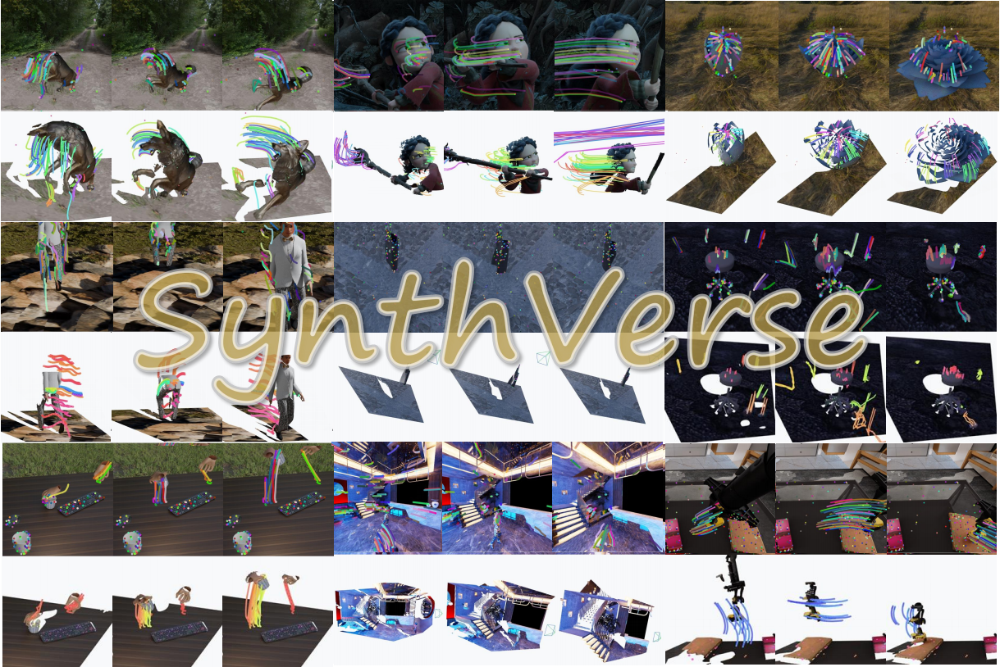

# SynthVerse
## SynthVerse: A Large-Scale Diverse Synthetic Dataset for Point Tracking

[](https://weiguangzhao.github.io/SynthVerse/)
[](https://arxiv.org/abs/2602.04441)
[](https://huggingface.co/datasets/InternRobotics/SynthVerse)
[](https://huggingface.co/datasets/InternRobotics/SynthVerse-Benchmark)


### Roadmap

- [x] Release SynthVerse Benchmark
- [x] Release SynthVerse Dataset
- [ ] Code for Data Making
- [ ] Code for Dataloader

## Benchmark and Dataset



We release **SynthVerse Benchmark and Dataset** for systematic evaluation under diverse domain shifts. See the Hugging Face dataset card for splits, metrics, and usage:

- [InternRobotics/SynthVerse-Benchmark](https://huggingface.co/datasets/InternRobotics/SynthVerse-Benchmark)
- [InternRobotics/SynthVerse](https://huggingface.co/datasets/InternRobotics/SynthVerse)

## Data format
```
  ├── seq_0001
  │   ├── seq_0001.npy                  # np.ndarray(object) -> dict
  │   │   ├── coords:       float32 [T1, N, 2]
  │   │   ├── depth_range:  float32 [2]
  │   │   ├── intrinsics:   float32 [T1, 3, 3]
  │   │   ├── matrix_world: float32 [T1, 4, 4]
  │   │   ├── occluded:     uint8/bool [T1, N]
  │   │   └── traj_3d:      float32 [T1, N, 3]
  │   └── frames
  │       ├── 0000.png                        # RGB, uint8, [H, W, 3]
  │       ├── 0000_depth.png                  # I;16, uint16, [H, W]
  │       ├── 0001.png
  │       ├── 0001_depth.png
  │       └── ...
  └── seq_0002
      ├── seq_0002.npy                  # np.ndarray(object) -> dict
      │   ├── coords:       float32 [T2, N, 2]
      │   ├── depth_range:  float32 [2]
      │   ├── intrinsics:   float32 [T2, 3, 3]
      │   ├── matrix_world: float32 [T2, 4, 4]
      │   ├── occluded:     uint8/bool [T2, N]
      │   └── traj_3d:      float32 [T2, N, 3]
      └── frames
          ├── 0000.png
          ├── 0000_depth.png
          ├── 0001.png
          ├── 0001_depth.png
          └── ...
```

## Pipeline

SynthVerse data generation pipeline:


## BibTeX

If you find SynthVerse useful, please cite:

```bibtex
@article{zhao2026SythnVerse,
  title={SynthVerse: A Large-Scale Diverse Synthetic Dataset for Point Tracking},
  author={Weiguang Zhao and Haoran Xu and Xingyu Miao and Qin Zhao and Rui Zhang and Kaizhu Huang and Ning Gao and Peizhou Cao and Mingze Sun and Mulin Yu and Tao Lu and Linning Xu and Junting Dong and Jiangmiao Pang},
  journal={arXiv preprint arXiv:2602.04441},
  year={2026}
}
```

## Acknowledgement

This project would not be possible without many excellent open-source codebases. Notable examples include [Kubric](https://github.com/google-research/kubric), [PointOdyssey](https://github.com/y-zheng18/point_odyssey), [TAPNET](https://github.com/google-deepmind/tapnet), and [TAPIP3D](https://github.com/zbw001/TAPIP3D), among others.

## Contact

**Email:** weiguang.zhao@liverpool.ac.uk

---


